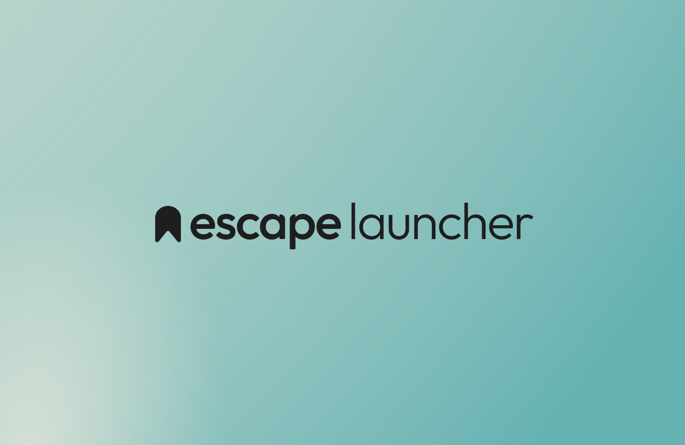

<!--suppress ALL -->

 
 

Escape launcher is a minimalist app launcher that replaces the default homes screen on android devices to help with social media and smartphone addiction. It has a simple yet customisable, material-ui-3 based design with a home page with favourite apps, support for widgets, clock, date, screen times. It also has a full apps list with search, work apps and a built in screen time tracking dashboard. It was one of the first and is still one of the only launchers to support the new private space profile that was added an Android 15. Escape launcher supports Android 8 (`minSDK = 26`) up until the latest release of android 16 (`targetSDK = 36`)

 

<table style="border-collapse: collapse; border: none;">
  <tr>
    <td style="border: none;">
      
    </td>
    <td style="border: none;padding: 10%">
      

<h1 align="center">
  Features
</h1>
        <ul>
        <li>Colour themes</li>
        <li>Fonts</li>
          <li>Haptic Feedback</li>
          <li>Clock</li>
          <li>Date</li>
          <li>Multi-line Clock</li>
          <li>Android Widget support</li>
          <li>Horizontal and Vertical alignment options</li>
          <li>Search box</li>
          <li>Hide apps</li>
          <li>Show screen time on home page</li>
          <li>Show screen time next to apps</li>
          <li>App Open countdown</li>
        </ul>
      

    </td>
  </tr>
</table>

 

<table>
  <tr>
    <td width="150" height="300">
      
    </td>
    <td width="150" height="300">
      
    </td> 
    <td width="150" height="300">
      
    </td>
    <td width="150" height="300">
      
    </td>
    <td width="150" height="300">
      
    </td>
    <td width="150" height="300">
      
    </td> 
    <td width="150" height="300">
      
    </td>
    <td width="150" height="300">
      
    </td>
  </tr>
<tr>
    <td>
      Built In screen time tracking
    </td>
    <td>
     One of the only android launchers to support Android 15 Private space
    </td> 
    <td>
      Countdown before opening distracting apps
    </td>
    <td>
      Customisable Font
    </td>
    <td>
      Manage your apps
    </td>
    <td>
     Minimalist Home Screen with Clock, Screen Times, Date and more
    </td> 
    <td>
      Minimalist Apps List with Search and Private space support
    </td>
    <td>
      And much more
    </td>
  </tr>
</table>

 

<h1>
  Installing for non-developers
</h1>

To install the app, you need to download an apk for the app. This is the file that contains the app and can be opened to install the app on your phone. You can download one from the [github releases page](https://github.com/GeorgeClensy/Escape-Launcher/releases/) or [the F-Droid page](https://f-droid.org/en/packages/com.geecee.escapelauncher). If you go onto the github releases page, you will see two .apk files at the bottom: A FOSS version and a normal version. The FOSS version removes any non open source libraries (open source means the code is visible to the public for free online) such as the google fonts, and weather libraries which means these features, along with a few others, will be missing. Alternativly, you can use the normal version which includes all the features in a smaller download. The F-Droid page only contains the FOSS version.

Once you have your file downloaded, open up your files app from your home screen. Go to downloads and click on the Escape Launcher file. It will ask if you want to install it. Press install. If a popup shows saying the app was blocked by google play protect, you can disable play protect from within the google play store settings (just google how to do this if you don't know how). Make sure to enable play protect again afterwards though to prevent accidentally installing malware.

The app should now be installed and can be opened from the home screen. You will be guided through the setup, enjoy!

 

<h1>
  Building and running
</h1>

Escape Launcher has four build variants:
- `fossDebug` - The main variant for development, does not contain any Google APIs, can be built in Android Studio without any setup.
- `fossRelease` - The main release version without Google APIs, can be built in android studio without any setup. Do not try to develop on this variant, builds run proguard and will take a long time.
- `googleDebug` - Development variant with Google APIs, requires a `google-services.json` file for firebase to build. You will need to use your own firebase account to build this variant.
- `googleRelease` - The main release version with Google APIs, requires a `google-services.json` file for firebase to build. You will need to use your own firebase account to build this variant. Do not try to develop on this variant, builds run proguard and will take a long time.

 

<h1>
  Contributing
</h1>

If you wish to contribute code, feel free to have a look at the projects page to see what needs doing, comment on any issues before starting just to make sure I haven't already done it and that I do want it in the app. Then, clone the repo, make your changes and create a PR. Apologies if I decline the merge. Please avoid any "vibe coding" or coding purely with AI and no human imput and try to follow the project style guide.

You can also help by translating the app's strings. To do this: clone the repo, go to `./core/ui/res/values-en` and copy `string.xml` into `./core/ui/res/values-NEW-LANG-CODE/strings.xml`. Then edit the strings.xml and create a PR. You can see a list of all the language codes [here](https://github.com/championswimmer/android-locales). I will check your translations with AI and then will merge your branch.

If you cannot code or speak another language but stil want to help, you can [donate here](https://github.com/sponsors/GeorgeClensy).

Thanks!

 

<h1>
  Donating
</h1>

At the moment, it is just me working on this app so I would really appriciate it if you donated with [github sponsors](https://github.com/sponsors/GeorgeClensy)!

<h1>
Star History
</h1>

<h1>
  Sponsors
</h1>
Thank you to everyone who has donated to the project!  
Here are all the previous sponsors who have not set the sponsorship as private:  
@iguoliveira  
@Atlasatalaika  
@guillaumecello  
@user31676  

